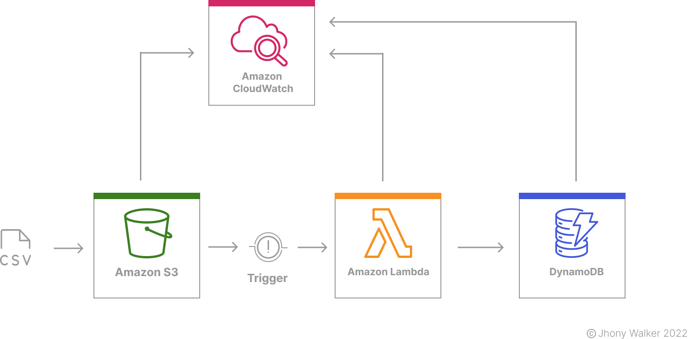

## Repository summary

This project involves the AWS stack where it works on adding static data to the database by loading the contents of a CSV file into an S3 bucket and triggering a Lambda function that stores it in DynamoDB. Although CSV seems biblically old, it is still often used in IT projects to exchange data or import from one data store to another.

<h1 align="center">
    
</h1>

## Architecture

<h1 align="center">
    
</h1>

## Technologies

| Language | Framework/Superset | Framework/Superset | Database |
| -------- | ------------------ | ------------------ | -------- |
| Node.js  | Typescript         | Serveless          | DynamoDB |

In addition to the following dependencies:

- **[AWS Lambda](https://www.npmjs.com/package/aws-lambda)** - Command line tool deploy code to AWS Lambda.
- **[AWS SDK](https://www.npmjs.com/package/aws-sdk)** - The version 3.x of the AWS SDK for JavaScript is generally available
- **[Dotenv Safe](https://www.npmjs.com/package/dotenv-safe)** - Identical to dotenv, but ensures that all necessary environment variables are defined after reading from .env. These needed variables are read from .env.example, which should be commited along with your project.
- **[Source Map Support](https://www.npmjs.com/package/source-map-support)** - This module provides source map support for stack traces in node via the V8 stack trace API. It uses the source-map module to replace the paths and line numbers of source-mapped files with their original paths and line numbers
- **[TypeDI](https://www.npmjs.com/package/typedi)** - Is a dependency injection tool for TypeScript and JavaScript. With it you can build well-structured and easily testable applications in Node or in the browser.
- **[Winston](https://www.npmjs.com/package/winston)** - A logger for just about everything.
- **[Winston Cloudwatch](https://www.npmjs.com/package/winston)** - Send logs to Amazon Cloudwatch using Winston.

## License

The MIT license, also called the X license or the X11 license, is a computer program license created by the Massachusetts Institute of Technology. It is a permissive license used in both free software and proprietary software.
